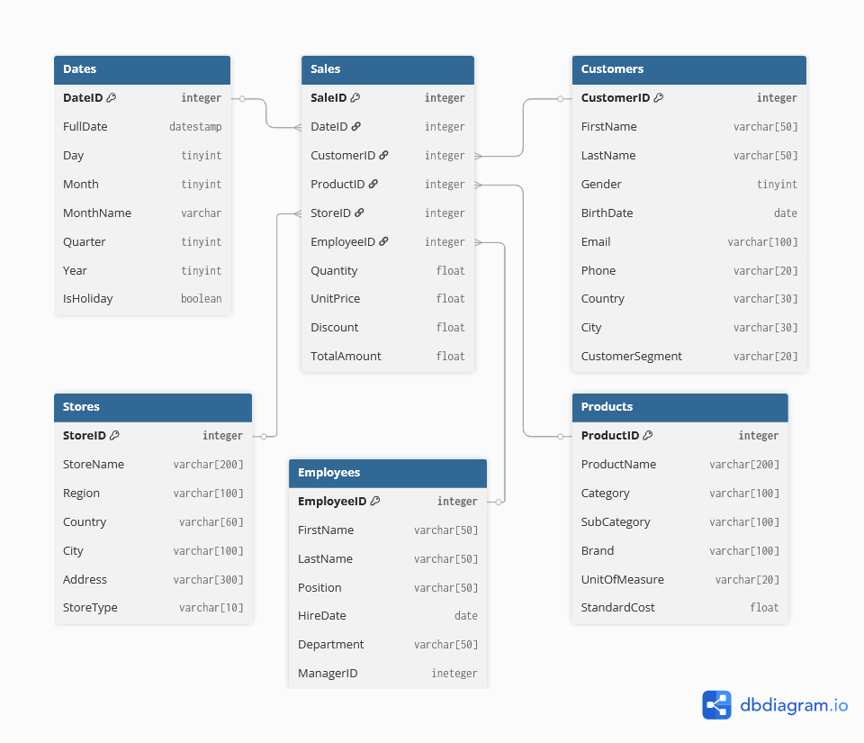

# Practice:

Build a schema for a mini Data Warehouse:
- Fact: sales.
- Dimensions: customers, products, time.
- Use dbdiagram.io or draw.io.

# What did I do?

I took a standard set of fields for this kind of task. Some tables are not very logical (for example, the linking dates to Sales table by foreign key seems strange to me), but I took them out to get a more visual star shape.



### Dbdiagram.io script:
```sql
table Sales {
  SaleID integer [primary key]
  DateID integer
  CustomerID integer
  ProductID integer
  StoreID integer
  EmployeeID integer
  Quantity float
  UnitPrice float
  Discount float
  TotalAmount float
}

table Dates {
  DateID integer [primary key]
  FullDate datestamp
  Day tinyint
  Month tinyint
  MonthName varchar
  Quarter tinyint
  Year tinyint
  IsHoliday boolean
}

table Customers {
  CustomerID integer [primary key]
  FirstName varchar[50]
  LastName varchar[50]
  Gender tinyint
  BirthDate date
  Email varchar[100]
  Phone varchar[20]
  Country varchar[30]
  City varchar[30]
  CustomerSegment varchar[20]
}

table Products {
  ProductID integer [primary key]
  ProductName varchar[200]
  Category varchar[100]
  SubCategory varchar[100]
  Brand varchar[100]
  UnitOfMeasure varchar[20]
  StandardCost float
}

table Stores {
  StoreID integer [primary key]
  StoreName varchar[200]
  Region varchar[100]
  Country varchar[60]
  City varchar[100]
  Address varchar[300]
  StoreType varchar[10]
}

table Employees {
  EmployeeID integer [primary key]
  FirstName varchar[50]
  LastName varchar[50]
  Position varchar[50]
  HireDate date
  Department varchar[50]
  ManagerID ineteger
}

Ref: Sales.DateID > Dates.DateID

Ref: Sales.CustomerID > Customers.CustomerID

Ref: Sales.ProductID > Products.ProductID

Ref: Sales.StoreID > Stores.StoreID

Ref: Sales.EmployeeID > Employees.EmployeeID
```
### SQL Server script imported from dbdiagram.io:
```sql
CREATE TABLE [Sales] (
  [SaleID] integer PRIMARY KEY,
  [DateID] integer,
  [CustomerID] integer,
  [ProductID] integer,
  [StoreID] integer,
  [EmployeeID] integer,
  [Quantity] float,
  [UnitPrice] float,
  [Discount] float,
  [TotalAmount] float
)
GO

CREATE TABLE [Dates] (
  [DateID] integer PRIMARY KEY,
  [FullDate] datestamp,
  [Day] tinyint,
  [Month] tinyint,
  [MonthName] nvarchar(255),
  [Quarter] tinyint,
  [Year] tinyint,
  [IsHoliday] boolean
)
GO

CREATE TABLE [Customers] (
  [CustomerID] integer PRIMARY KEY,
  [FirstName] varchar[50],
  [LastName] varchar[50],
  [Gender] tinyint,
  [BirthDate] date,
  [Email] varchar[100],
  [Phone] varchar[20],
  [Country] varchar[30],
  [City] varchar[30],
  [CustomerSegment] varchar[20]
)
GO

CREATE TABLE [Products] (
  [ProductID] integer PRIMARY KEY,
  [ProductName] varchar[200],
  [Category] varchar[100],
  [SubCategory] varchar[100],
  [Brand] varchar[100],
  [UnitOfMeasure] varchar[20],
  [StandardCost] float
)
GO

CREATE TABLE [Stores] (
  [StoreID] integer PRIMARY KEY,
  [StoreName] varchar[200],
  [Region] varchar[100],
  [Country] varchar[60],
  [City] varchar[100],
  [Address] varchar[300],
  [StoreType] varchar[10]
)
GO

CREATE TABLE [Employees] (
  [EmployeeID] integer PRIMARY KEY,
  [FirstName] varchar[50],
  [LastName] varchar[50],
  [Position] varchar[50],
  [HireDate] date,
  [Department] varchar[50],
  [ManagerID] ineteger
)
GO

ALTER TABLE [Sales] ADD FOREIGN KEY ([DateID]) REFERENCES [Dates] ([DateID])
GO

ALTER TABLE [Sales] ADD FOREIGN KEY ([CustomerID]) REFERENCES [Customers] ([CustomerID])
GO

ALTER TABLE [Sales] ADD FOREIGN KEY ([ProductID]) REFERENCES [Products] ([ProductID])
GO

ALTER TABLE [Sales] ADD FOREIGN KEY ([StoreID]) REFERENCES [Stores] ([StoreID])
GO

ALTER TABLE [Sales] ADD FOREIGN KEY ([EmployeeID]) REFERENCES [Employees] ([EmployeeID])
GO
```