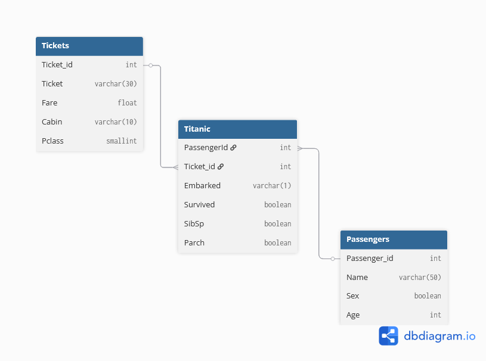

# Star Schema variant for Titanic database

Using [dbdiagram.io](https://dbdiagram.io).



```sql
table Titanic {
  PassengerId int [ref: > Passengers.Passenger_id]
  Ticket_id int [ref: > Tickets.Ticket_id]
  Embarked varchar(1)
  Survived boolean 
  SibSp boolean
  Parch boolean

}

table Passengers {
  Passenger_id int
  Name varchar(50)
  Sex boolean
  Age int
}

table Tickets {
  Ticket_id int
  Ticket varchar(30)
  Fare float
  Cabin varchar(10)
  Pclass smallint
}
```